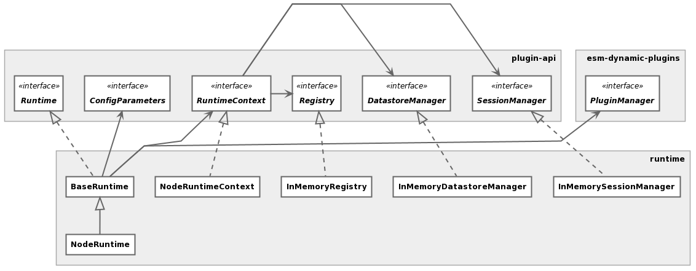

# runtime
[](https://github.com/flowscripter/runtime/blob/master/LICENSE)
[](https://david-dm.org/flowscripter/runtime)
[](https://travis-ci.com/flowscripter/runtime)
[](https://sonarcloud.io/dashboard?id=flowscripter_runtime)
[](https://www.npmjs.com/package/@flowscripter/runtime)

> Flowscripter Runtime.

## Overview

This project provides a Runtime for the Flowscripter system.

The following high level class diagram illustrates the key concepts:



**This is a work in progress**

## Development

Firstly:

```
npm install
```

then:

Build: `npm run build`

Watch: `npm run watch`

Test: `npm test`

Lint: `npm run lint`

Docs: `npm run docs`

## API

[API documentation](https://flowscripter.github.io/runtime)

## Further Details

Further details on project configuration files and Javascript version support can be found in
the [template for this project](https://github.com/flowscripter/ts-template/blob/master/README.md#overview).

## License

MIT © Flowscripter
